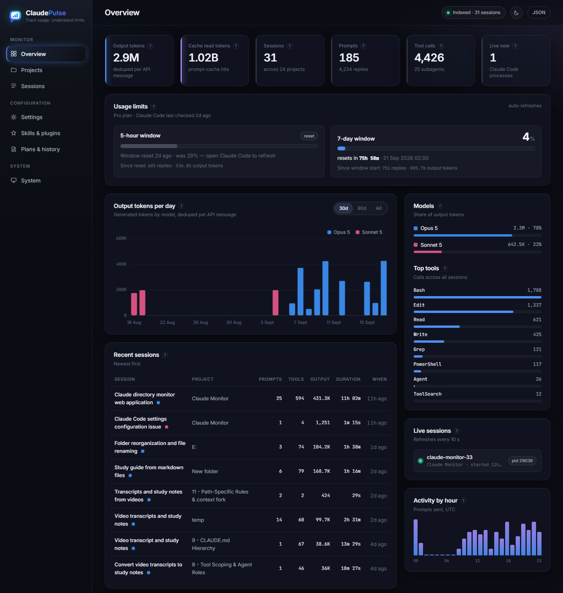
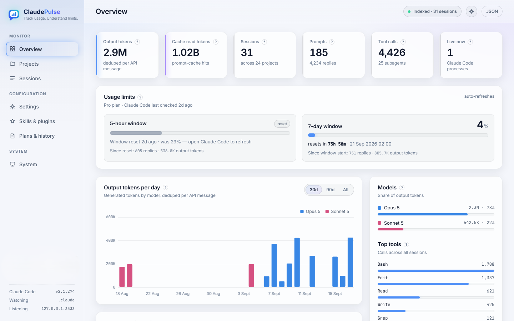

<p align="center"></p>

# ClaudePulse

**Track usage. Understand limits.** A local dashboard for your Claude Code usage. It watches `~/.claude`, indexes
every session transcript into a SQLite database, and serves a single-binary web
UI on **http://127.0.0.1:3333** — tokens per day and per model, projects,
sessions with timelines, tool usage, subagents, settings, skills & plugins,
plans, prompt history, your plan's rate-limit usage, and system health.

Everything stays on your machine: the server binds to loopback only, reads
`~/.claude` read-only, never touches the credentials file, and redacts settings
before storing them.

## Screenshots

**Overview** — KPIs, usage limits with live reset countdowns, output tokens per day, model share, top tools, recent sessions, live processes and activity by hour.



<details>
<summary><b>Overview — light theme</b></summary>


</details>

Every other page (Projects, Sessions, Session detail, Settings, Skills & plugins, Plans & history, System) follows the same layout — run the app to see them against your own data.

## Quick start

Requires Go 1.25+ (`go.mod` pins it; `GOTOOLCHAIN=auto` fetches it) — no CGO,
no Node.

```bash
go build -o bin/claudepulse.exe ./cmd/claudepulse
./bin/claudepulse.exe
# → open http://127.0.0.1:3333
```

The first run indexes your whole history (≈150 MB of transcripts takes about
1.5 s). After that, changes under `~/.claude` are picked up within a few
seconds via file-system notifications, with a full rescan every 30 s as a
safety net.

Stop it with Ctrl-C. State lives in `data/claudepulse.db`; delete it (or
run with `-reset-db`) to re-index from scratch.

## Where it finds your data

ClaudePulse reads the current user's own Claude Code directory, so it needs no
special permissions — no admin/root, no elevation. Detection matches Claude
Code itself:

1. `CLAUDE_CONFIG_DIR`, if that environment variable is set;
2. otherwise `~/.claude` in the user's home directory
   (`%USERPROFILE%\.claude` on Windows, `$HOME/.claude` on Linux and macOS).

Anyone running it on their own laptop therefore sees their own usage. If Claude
Code has never run on the machine the folder does not exist and ClaudePulse
exits with a clear message. `-claude-dir` overrides the location.

## Platforms

Pure Go, no CGO: Windows, Linux and macOS (amd64 and arm64) are supported by
the same code. Build for your platform, or cross-compile everything:

```bash
# Linux / macOS
CGO_ENABLED=0 go build -o claudepulse ./cmd/claudepulse && ./claudepulse

# all platforms into dist/ (POSIX shell; Git Bash works on Windows)
scripts/build-all.sh v1.3.0
```

On Linux, `scripts/claudepulse.service` is a systemd *user* unit that starts
it at login:

```bash
install -Dm755 claudepulse ~/.local/bin/claudepulse
mkdir -p ~/.local/share/claudepulse ~/.config/systemd/user
cp scripts/claudepulse.service ~/.config/systemd/user/
systemctl --user daemon-reload && systemctl --user enable --now claudepulse
```

## Options

| Flag | Env | Default | Meaning |
|---|---|---|---|
| `-addr` | `CP_ADDR` | `127.0.0.1:3333` | Listen address. Loopback IPs only; a busy port is a hard error. |
| `-claude-dir` | `CP_CLAUDE_DIR` | `$CLAUDE_CONFIG_DIR` or `~/.claude` | Directory to monitor. |
| `-db` | `CP_DB` | `data/claudepulse.db` | SQLite file. Must not be inside `-claude-dir`. |
| `-scan-interval` | `CP_SCAN_INTERVAL` | `30s` | Safety-net rescan cadence. |
| `-log-level` | `CP_LOG_LEVEL` | `info` | `debug` logs every file indexed and every request. |
| `-reset-db` | — | off | Delete the database and re-index. |
| `-version` | — | — | Print the build version and exit. |

Flags override environment variables, which override defaults.

## What you see

- **Overview** — KPIs (output tokens, cache reads, sessions, prompts, tool
  calls, live processes), a **Usage limits** strip (% of each rate-limit
  window used, a live countdown to its reset, and the replies/tokens counted
  inside the window), tokens per day by model, model share, top tools,
  recent sessions, live Claude Code processes, activity by hour, plan usage,
  and Claude Code's own `stats-cache.json` figures for comparison.
- **Projects** — every directory you have used Claude Code in, with sessions,
  prompts, tool calls, output and whether it still exists on disk.
- **Sessions** — filter by project, model, date range or title; each session
  has a timeline chart, subagents, model share and tool breakdown.
- **Settings** — your user `settings.json` (secrets redacted) and what each
  project adds: `CLAUDE.md`, settings, agents, commands, skills, MCP servers.
- **Skills & plugins** — user, claude.ai-synced and project skills;
  marketplaces, installed and synced plugins.
- **Plans & history** — plan-mode documents and a searchable prompt history.
- **System** — Claude Code version and update state, account and plan usage,
  index health, disk usage per folder, database size, monitor configuration.

Usage insights · limit awareness · better planning · more productivity.
Hover the `?` next to any figure for a one-line explanation. The moon/sun
button switches between dark and light themes (remembered per browser).

### About the numbers

Claude Code writes each API response to the transcript as several lines that
repeat the same token usage. This dashboard counts usage **once per API
message**; Claude Code's own `stats-cache.json` sums every line, so its
figures run 2–3× higher. Both are shown, labelled.

Plan usage (5-hour / 7-day windows) is read from the snapshot Claude Code
caches in `~/.claude.json`. If a window has already reset since that snapshot,
it is shown greyed as "reset · was N%" rather than as a current value.

## Privacy

- Reads `~/.claude`, `~/.claude.json`, and — for each project you have used
  Claude Code in — that project's `CLAUDE.md` (size only), `.claude/settings*.json`,
  the names of its `.claude/agents`, `commands` and `skills`, and the server
  names in `.mcp.json`. Project source files are never read. Nothing is written
  anywhere except the database.
- Never reads `~/.claude/.credentials.json` or `~/.claude/sessions/*.key`,
  and never lists them.
- Settings files are stored with `env` values, credential-like keys and hook
  commands replaced by `[redacted]` before they reach the database.
- No message content is stored or rendered. The only prompt text shown is the
  first 160 characters of each entry in `history.jsonl`, on the Plans & history
  page — the same list Claude Code uses for prompt recall. Session titles,
  subagent task labels and plan headings (all title-like, written by Claude
  Code) are shown as-is.
- The database (`data/claudepulse.db`) contains per-message token counts,
  session titles, subagent labels, tool names, paths, redacted settings, skill
  and plan metadata, a copy of `stats-cache.json`, your account email/plan and
  the truncated history. Delete it to remove all derived data.

## Run at login (Windows)

Register a Task Scheduler job that starts the monitor when you sign in
(adjust the paths):

```powershell
$exe = "C:\path\to\claudepulse.exe"
$dir = "C:\path\to\ClaudePulse"
Register-ScheduledTask -TaskName "ClaudePulse" `
  -Action (New-ScheduledTaskAction -Execute $exe -WorkingDirectory $dir) `
  -Trigger (New-ScheduledTaskTrigger -AtLogOn) `
  -Settings (New-ScheduledTaskSettingsSet -ExecutionTimeLimit 0 `
              -AllowStartIfOnBatteries -DontStopIfGoingOnBatteries)
```

The binary is a console program, so a window stays open while it runs; run it
through `conhost --headless` or a small VBScript wrapper if you want it hidden.
Remove the task with `Unregister-ScheduledTask -TaskName "ClaudePulse"`.

## JSON API

The dashboard, sessions and system data are also available as JSON:

```
GET /healthz
GET /api/v1/summary?days=30
GET /api/v1/daily?days=90
GET /api/v1/live
GET /api/v1/system
GET /api/v1/sessions?project=&model=&range=&q=&limit=&offset=
GET /api/v1/sessions/{id}
GET /api/v1/usage
```

## Development

```bash
go vet ./... && gofmt -l .        # lint
go test ./... -count=1            # tests run against testdata/claude-home, never your real data
go run ./cmd/claudepulse -claude-dir ./testdata/claude-home -db ./data/test.db
```

Architecture, data model, the UI design system and the phase history are in
[`docs/PLAN.md`](docs/PLAN.md). `CLAUDE.md` carries the conventions Claude
Code follows when working in this repository.

## License

MIT
